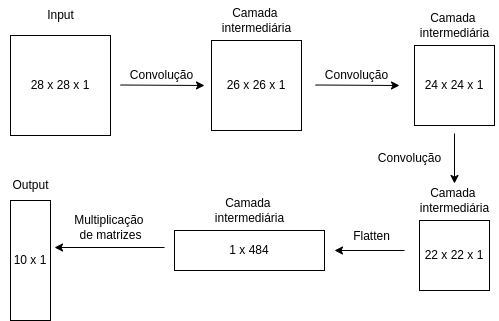
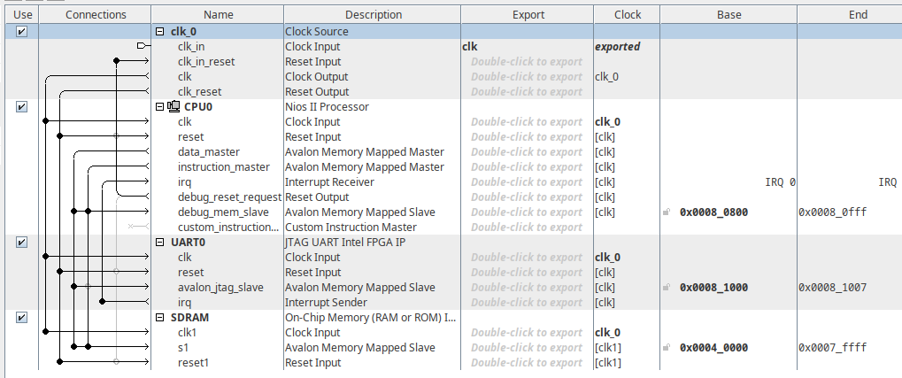

# Embedded systems project

Implementation of a convolutional neural network for image classification executing in a FPGA board using a NIOS II processor, instancialized with Quartus Platform Designer.

The CNN was trained in Python using TensorFlow to classify MNIST dataset images. The network achitecture was very simple, just 3 convolutional layers and 1 fully-connected layer, without bias. The CNN weights and MNIST images were saved in a custom format for execution of the classification in a C language application. This can be found in the jupyter notebook 'CNN/CNN-weights-and-MNIST-images'. The detailed CNN architecture can be seen in 'documentation/architecture.png' (or in the image bellow) and the exported files can be found in the 'CNN/weights' and 'CNN/images' directories.

The C program for the CNN execution can be found in 'CNN/main.c'. For this, the weights and images were declared statically as float arrays and initizalized by effectvelly copy and pasting the exported values throught the "#include" directive. This way, the compiled program already has all the information that it needs to execute the classification. To compile the code, execute `gcc -lm CNN/main.c`. To change the image being classified, change the image file being included in the code.

To send the code for execution on the FPGA board, the software Quartus Prime Lite was used. Moreover, to configure the NIOS II softcore processor, the Platform Designer tool, previously knows as Qsys was used. The configuration used 256K On-Chip RAM memory and a device to allow the use of JTAG/USB. The specific FPGA board used was FPGA Cyclone IV EP4CE115 do kit DE2-115. The Platform Designer conections can be seen in 'documentation/platform-designer-conections.png' (or in the image bellow).

